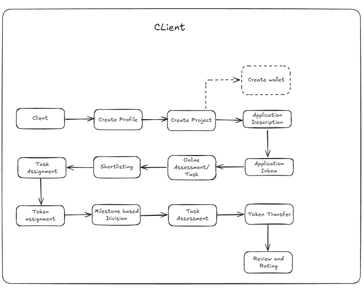
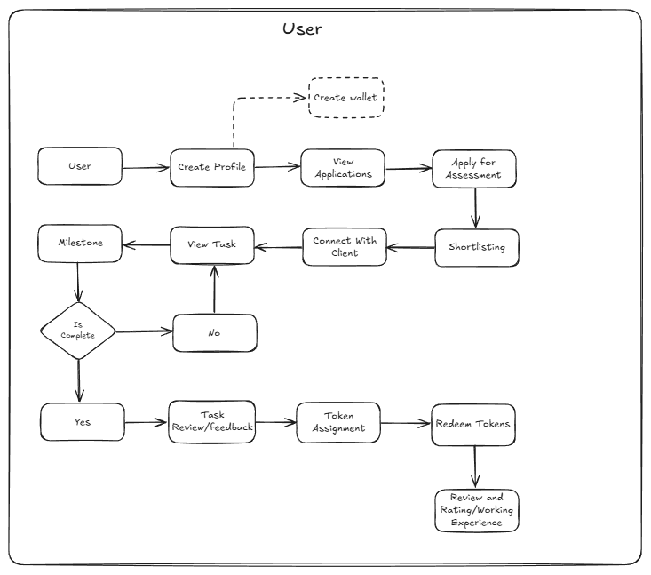

# Hire-It

A web-based platform connecting recruiters and freelancers for short-term, milestone-based project collaboration with transparency, fair compensation, and trust.

## 1. Problem Statement

The freelance and short-term project economy is plagued by inefficiencies and a fundamental lack of trust. Companies struggle to find and vet reliable talent, while freelancers face the constant risk of delayed or disputed payments. The absence of a standardized process for project management, evaluation, and compensation creates friction, discourages quality talent from participating, and leads to project failures. This environment of uncertainty hinders the creation of decent work and sustainable economic opportunities.

## 2. Solution Overview

Our platform provides an end-to-end solution that builds trust and transparency into the short-term hiring process. We introduce a milestone-driven workflow coupled with a secure, token-based compensation system.

Companies post projects broken down into clear, manageable milestones, each with an assigned token value. These tokens are pre-funded by the company and held in escrow, guaranteeing payment for freelancers upon milestone completion. The platform further streamlines the process with built-in resume parsing for candidate shortlisting, an integrated Online Assessment (OA) workflow, and a dedicated communication system, ensuring all interactions from application to payment happen in one place.

## 3. Key Features

*   **Role-Based Profiles:** Dedicated profiles for Recruiters and Freelancers to showcase experience, skills, and portfolios.
*   **Project Posting with Milestones:** Recruiters can define projects with multiple, distinct milestones, each having a fixed token value for compensation.
*   **Token-Based Compensation System:** A secure system where recruiters purchase tokens to fund projects. Tokens are locked to milestones and automatically released to freelancers upon completion, who can redeem them at any time.
*   **Application-Driven Shortlisting:** After candidates apply for a project, our system parses their resumes to score and rank them, presenting the top N applicants to the recruiter.
*   **Integrated Online Assessment (OA) Workflow:** Shortlisted freelancers receive and complete OAs directly on the platform, with all communication managed internally.
*   **Built-in Communication System:** A messaging feature for all project-related discussions, including OA clarifications and milestone feedback.
*   **Project Dashboard:** A centralized dashboard to track milestone progress, submissions, OA status, and communications for both recruiters and freelancers.

## 4. System Workflow

**Step 1: Profile Creation**
*   **Companies** register and create recruiter profiles, detailing their organization, industry, and hiring preferences.
*   **Freelancers** sign up and build comprehensive profiles showcasing their skills, experience, education, and portfolio projects.

**Step 2: Project Posting**
*   Companies post new projects with clear descriptions, required skills, and defined milestones.
*   Each milestone has a fixed token value, and the company funds the entire project by purchasing the required amount of tokens upfront.

**Step 3: Application & Resume Parsing**
*   Freelancers browse available projects and submit their applications.
*   The system automatically parses freelancer resumes to extract and score skills and experience against project requirements.
*   The system presents the recruiter with the **top N ranked applicants** based on resume match.

**Step 4: Shortlisting & Assessment**
*   The recruiter reviews the shortlisted candidates and sends Online Assessments (OA) to evaluate their technical competency.
*   All assessments and feedback are conducted within the platform.

**Step 5: Project Assignment**
*   Based on assessment results and profile review, the recruiter selects and assigns the project to the best-fit freelancer.
*   The freelancer receives a clear project dashboard with all milestone details and expectations.

**Step 6: Milestone Execution & Token Flow**
*   The freelancer completes work according to the defined milestones and submits deliverables.
*   Upon the recruiter's approval of each milestone, the corresponding tokens are **automatically transferred to the freelancer's wallet**.
*   The freelancer can redeem tokens for currency at any time.

### Client (Recruiter) Workflow

### User (Freelancer) Workflow

## 5. Tech Stack
The platform is a web-based application built with a standard, reliable technology stack suitable for a hackathon prototype.

*   **Frontend:** A modern JavaScript library (React, Tailwind CSS) to create a responsive and user-friendly interface.
*   **Backend:** A robust server-side framework (Node.js/Express) to manage business logic, APIs, and the token system.
*   **Database:** A NoSQL database (PostgreSQL) to store user, project, and transaction data.

## 6. Alignment with SDG 8

This project directly supports **SDG 8 (Decent Work and Economic Growth)** by:

*   **Ensuring Fair and Prompt Pay:** The token-based escrow system guarantees that freelancers are paid for their work upon milestone completion, eliminating payment delays and disputes.
*   **Creating Transparent Work Opportunities:** By breaking down projects into clear milestones with defined deliverables and compensation, we provide a transparent and structured work environment.
*   **Fostering Economic Growth:** The platform lowers the barrier for skilled professionals to access project-based work, enabling them to participate in the digital economy and achieve economic independence.

## 7. Challenges & Limitations

Developed within the constraints of a hackathon, this prototype has certain limitations:

*   The resume parser uses basic keyword extraction and is not yet powered by advanced NLP.
*   The token system is a simulation and is not connected to a real-world payment gateway or blockchain.
*   The platform is designed for the core workflow and has not been optimized for large-scale performance or security.

## 8. Future Scope

To transition this prototype into a fully-featured platform, we plan the following enhancements:

*   **NLP-Powered Resume Parsing:** We will integrate advanced Natural Language Processing (NLP) models to achieve a deeper, semantic understanding of resumes. This will enable more accurate skill extraction and smarter candidate-to-project matching.
*   **Blockchain-Based Token System:** To enhance security and trust, we plan to migrate the token and payment system to a blockchain. This will create an immutable, transparent ledger of all transactions, making the compensation process even more reliable.
*   **Integrated Interview Rounds:** We will build a feature to conduct preliminary interview rounds directly within the platform, including video call capabilities and a shared coding environment, to further streamline the hiring process.

## 9. Conclusion

Our platform addresses critical trust and transparency gaps in the freelance economy. By combining a milestone-driven approach with a secure token-based payment system, we create a fair and efficient ecosystem where companies can find top talent and freelancers can engage in meaningful work with the assurance of prompt compensation. This model fosters a healthier digital work environment and contributes directly to the goal of decent work for all.
